- 任务说明：对文本进行编码，并进行语义检索
- 任务要求：
    - 加载文本编码模型
    - 对提问和文档进行编码，并进行检索
- 打卡要求：加载三个编码模型，计算检索结果
## 语义检索流程

语义检索是通过词嵌入和句子嵌入等技术，将文本表示为语义丰富的向量。通过相似度计算和结果排序找到最相关的文档。用户查询经过自然语言处理处理，最终系统返回经过排序的相关文档，提供用户友好的信息展示。语义检索通过深度学习和自然语言处理技术，使得系统能够更准确地理解用户查询，提高检索的准确性和效果。

```mermaid
graph TD
    A[加载模型] -->|Sentence Transformer| B((编码文本))
    B -->|问题句子| C[问题Embeddings]
    B -->|PDF内容句子| D[PDF内容Embeddings]
    C -->|标准化| C
    D -->|标准化| D
    C -->|相似度计算| E[相似度矩阵]
    D -->|相似度计算| E
    E -->|排序| F[排序后的相似度]
    F -->|选取最大值| G[最相似的页码]
    G -->|写入结果| H[生成提交结果]
```



## 文本编码模型

文本编码模型对于语义检索的精度至关重要。目前，大多数语义检索系统采用预训练模型进行文本编码，其中最为常见的是基于 BERT（Bidirectional Encoder Representations from Transformers）的模型，或者使用 GPT（Generative Pre-trained Transformer）等。这些预训练模型通过在大规模语料上进行训练，能够捕捉词语和句子之间的复杂语义关系。选择合适的文本编码模型直接影响到得到的文本向量的有效性，进而影响检索的准确性和效果。

- 编码模型排行榜：[MTEB Leaderboard - a Hugging Face Space by mteb](https://huggingface.co/spaces/mteb/leaderboard)
    - 可以单独查看 英文 中文 的排行榜

- 下面几个文本编码模型都用到了 [SentenceTransformers](https://www.sbert.net/)，因为借助它可以用更少的代码实现文本或图像的嵌入
    - 不依赖它也能写，但需要自己写 Transformer 和 PyTorch 代码

- M3E
    - [moka-ai/m3e-small · Hugging Face](https://huggingface.co/moka-ai/m3e-small)
    - m3e-base 的 embedding 是 (768,)；m3e-small 的 embedding 是 (512,)
```python
!pip install sentence-transformers

from sentence_transformers import SentenceTransformer

model = SentenceTransformer('moka-ai/m3e-small')

question_sentences = [x['question'] for x in questions]
pdf_content_sentences = [x['content'] for x in pdf_content]

question_embeddings = model.encode(question_sentences, normalize_embeddings=True)
pdf_embeddings = model.encode(pdf_content_sentences, normalize_embeddings=True)

for query_idx, feat in enumerate(question_embeddings):
    score = feat @ pdf_embeddings.T
    max_score_page_idx = score.argsort()[-1] + 1
    questions[query_idx]['reference'] = 'page_' + str(max_score_page_idx)

with open('submit.json', 'w', encoding='utf8') as up:
    json.dump(questions, up, ensure_ascii=False, indent=4)
```

- BGE
    - [BAAI/bge-small-zh-v1.5 · Hugging Face](https://huggingface.co/BAAI/bge-small-zh-v1.5)
```python
import json
import jieba
import pdfplumber
import numpy as np
from sklearn.feature_extraction.text import TfidfVectorizer
from sklearn.preprocessing import normalize
from sentence_transformers import SentenceTransformer

# 读取数据集
questions = json.load(open("questions.json"))
pdf = pdfplumber.open("初赛训练数据集.pdf")
pdf_content = []

def split_text_fixed_size(text, chunk_size):
  return [text[i:i+chunk_size] for i in range(0, len(text), chunk_size)] 

for page_idx in range(len(pdf.pages)):
  text = pdf.pages[page_idx].extract_text()
  for chunk_text in split_text_fixed_size(text, 40):
    pdf_content.append({
      'page':'page_'+str(page_idx + 1),
      'content':chunk_text
    })

model = SentenceTransformer('BAAI/bge-small-zh-v1.5')

question_sentences = [x['question'] for x in questions]
pdf_content_sentences = [x['content'] for x in pdf_content]

question_embeddings = model.encode(question_sentences, normalize_embeddings=True, show_progress_bar=True)
pdf_embeddings = model.encode(pdf_content_sentences, normalize_embeddings=True, show_progress_bar=True)

for query_idx, feat in enumerate(question_embeddings):
    score = feat @ pdf_embeddings.T
    max_score_page_idx = score.argsort()[-1]
    questions[query_idx]['reference'] = pdf_content[max_score_page_idx]['page']

with open('wonder_bge_sgement_retrieval_top1.json', 'w', encoding='utf8') as up:
    json.dump(questions, up, ensure_ascii=False, indent=4)


def remove_duplicates(input_list):
  seen = set()
  result = []
  for item in input_list:
    if item not in seen:
      seen.add(item)
      result.append(item)
  return result

for query_idx,feat in enumerate(question_embeddings):
  score = feat @ pdf_embeddings.T
  max_score_page_idx = score.argsort()[::-1]
  pages =[pdf_content[x]['page']for x in max_score_page_idx]
  questions[query_idx]['reference'] = remove_duplicates(pages[:100])[:10]

with open('wonder_bge_sgement_retrieval_top10.json', 'w', encoding='utf8') as up:
    json.dump(questions, up, ensure_ascii=False, indent=4)
```

- BCEmbedding
```python
model = SentenceTransformer("/maidalun1020/bce-embedding-base_v1", device='cuda') model.max_seq_length = 512

# 剩余代码与M3E部分相同
```
## 文本切分方法

文本的长度是另一个关键因素，影响了文本编码的结果。短文本和长文本在编码成向量时可能表达不同的语义信息。即使两者包含相同的单词或有相似的语义，由于上下文的不同，得到的向量也会有所不同。因此，当在语义检索中使用短文本来检索长文本时，或者反之，可能导致一定的误差。针对文本长度的差异，有些系统采用截断或填充等方式处理，以保持一致的向量表示。

更多阅读资料：
- [Text Splitters | 🦜️🔗 Langchain](https://python.langchain.com/docs/modules/data_connection/document_transformers/)
- [分割案例 ChunkViz (railway.app)](https://chunkviz.up.railway.app/)

|名称|分割依据|描述|
|---|---|---|
|递归式分割器|一组用户定义的字符|递归地分割文本。递归分割文本的目的是尽量保持相关的文本段落相邻。这是开始文本分割的推荐方式。|
|HTML 分割器|HTML 特定字符|基于 HTML 特定字符进行文本分割。特别地，它会添加有关每个文本块来源的相关信息（基于 HTML 结构）。|
|Markdown 分割器|Markdown 特定字符|基于 Markdown 特定字符进行文本分割。特别地，它会添加有关每个文本块来源的相关信息（基于 Markdown 结构）。|
|代码分割器|代码（Python、JS）特定字符|基于特定于编码语言的字符进行文本分割。支持从 15 种不同的编程语言中选择。|
|Token 分割器|Tokens|基于 Token 进行文本分割。存在一些不同的 Token 计量方法。|
|字符分割器|用户定义的字符|基于用户定义的字符进行文本分割。这是较为简单的分割方法之一。|
|语义分块器|句子|首先基于句子进行分割。然后，如果它们在语义上足够相似，就将相邻的句子组合在一起。|

对于自然语言，推荐使用 Token 分割器，结合 Chunk Size 和 Overlap Size 可以得到不同的切分：
- **Chunk Size（块大小）**：表示将文本划分为较小块的大小。这是分割后每个独立文本块的长度或容量。块大小的选择取决于应用的需求和对文本结构的理解。
    - Chunck Size 的大小设置可以参考用户提问的 token 大小，最简单就是将 size 大小设置为用户提问平均 token 大小
- **Overlap Size（重叠大小）**：指相邻两个文本块之间的重叠部分的大小。在切割文本时，通常希望保留一些上下文信息，重叠大小就是控制这种上下文保留的参数。
    - 设定 overlap 后可以一定程度上避免分割导致的信息丢失

```python
import json
import jieba
import pdfplumber
import numpy as np
from sklearn.feature_extraction.text import TfidfVectorizer
from sklearn.preprocessing import normalize
from sentence_transformers import SentenceTransformer

# 读取数据集
questions = json.load(open("questions.json"))
pdf = pdfplumber.open("初赛训练数据集.pdf")
pdf_content = []

def split_text_fixed_size(text, chunk_size):
  return [text[i:i+chunk_size] for i in range(0, len(text), chunk_size)] 

for page_idx in range(len(pdf.pages)):
  text = pdf.pages[page_idx].extract_text()
  for chunk_text in split_text_fixed_size(text, 40):
    pdf_content.append({
      'page':'page_'+str(page_idx + 1),
      'content':chunk_text
    })

print(pdf_content[2])
print(pdf_content[3])

model = SentenceTransformer('moka-ai/m3e-small')

question_sentences = [x['question'] for x in questions]
pdf_content_sentences = [x['content'] for x in pdf_content]

question_embeddings = model.encode(question_sentences, normalize_embeddings=True)
pdf_embeddings = model.encode(pdf_content_sentences, normalize_embeddings=True)

for query_idx, feat in enumerate(question_embeddings):
    score = feat @ pdf_embeddings.T
    max_score_page_idx = score.argsort()[-1] + 1
    questions[query_idx]['reference'] = 'page_' + str(max_score_page_idx)

with open('submit_m3e_small_sgement.json', 'w', encoding='utf8') as up:
    json.dump(questions, up, ensure_ascii=False, indent=4)
```