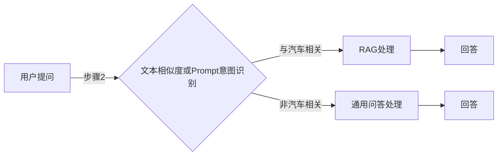

- 任务说明：使用文本相似度和 prompt 进行意图识别
    - 识别出问题是否与汽车相关
- 任务要求：
    - 计算提问与现有文档的相似度
    - 构造 prompt 完成意图识别
- 打卡要求：完成 RAG 完整流程，并提交结果进行打分



通过这种方式，意图识别允许系统更加灵活地适应用户的多样化需求。它允许系统在不同的上下文中识别用户意图，从而提供更准确、定制的回答。这种方法的优势在于通过使用专门的模型来处理特定领域的问题，可以提高系统的准确性和用户体验。
## 文本相似度

- 步骤 1：提取用户提问的嵌入向量
- 步骤 2：提取文档所有的嵌入向量
- 步骤 3：判断提问向量与文档向量的最低相似度，结合相似度大小进行判断
## Prompt 意图识别

```
你是一个汽车维修和汽车销售的专家，请判断下面的提问是否与汽车使用相关。

{用户提问}

输出：相关 / 不相关
```